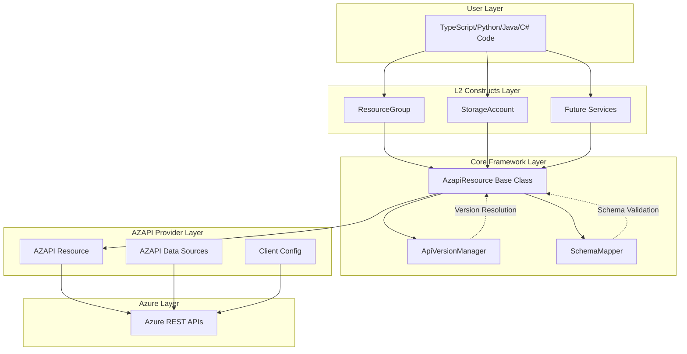
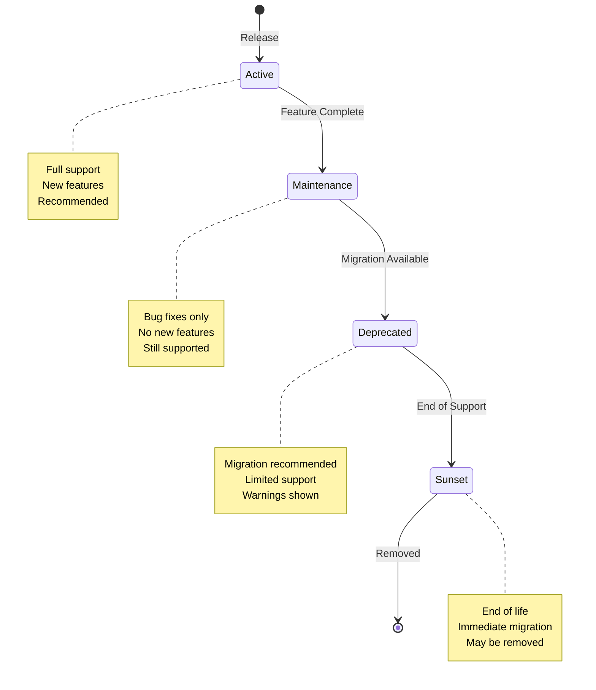
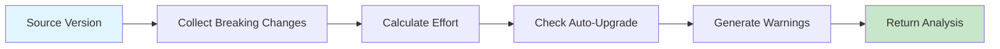
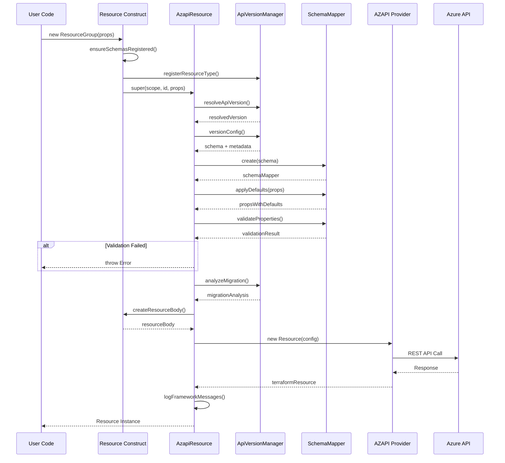
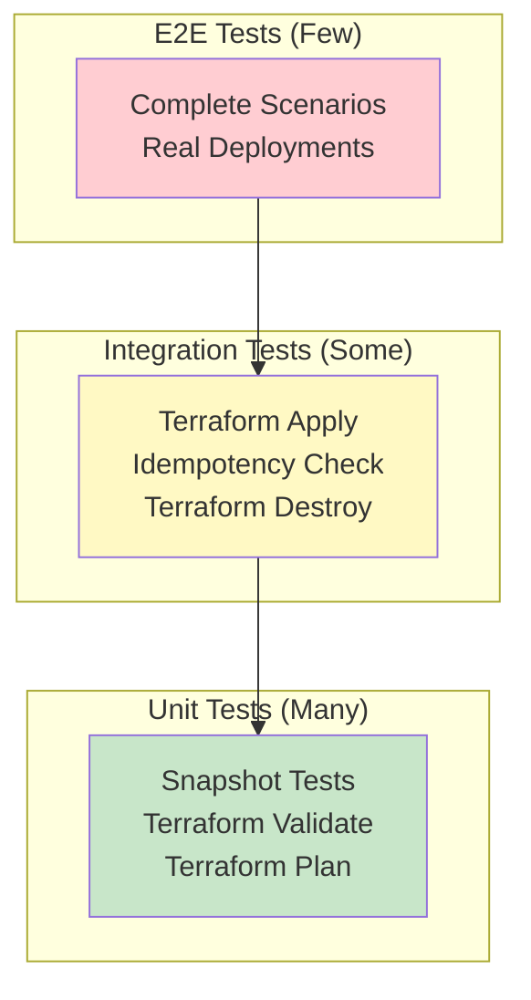
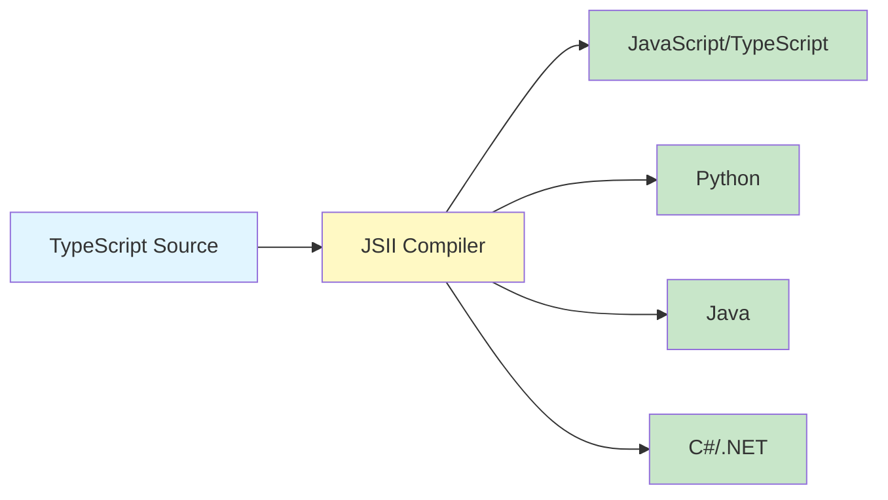

# Terraform CDK Constructs - High-Level Architecture

**Version:** 1.0.0  
**Last Updated:** 2025-10-22  
**Status:** AZAPI Provider Implementation

---

## Table of Contents

1. [Executive Summary](#executive-summary)
2. [Architecture Overview](#architecture-overview)
3. [Core Components](#core-components)
4. [Package Structure](#package-structure)
5. [Key Architectural Patterns](#key-architectural-patterns)
6. [Version Management System](#version-management-system)
7. [Resource Creation Flow](#resource-creation-flow)
8. [Testing Architecture](#testing-architecture)
9. [Multi-Language Support](#multi-language-support)
10. [Design Principles](#design-principles)
11. [Future Extensibility](#future-extensibility)

---

## Executive Summary

The `@microsoft/terraform-cdk-constructs` package is a TypeScript-based library that provides **Level 2 (L2) constructs** for Azure infrastructure using the **AZAPI provider**. Version 1.0.0 represents a major architectural shift from AzureRM provider to AZAPI provider, enabling direct Azure REST API access without provider limitations.

### Key Characteristics

- **Direct API Access**: Uses AZAPI provider for immediate access to new Azure features
- **Version-Aware**: Automatic API version management with migration guidance
- **Multi-Language**: JSII-compliant for TypeScript, Python, Java, and C#/.NET
- **Self-Contained**: Includes AZAPI provider bindings (no external generation needed)
- **Production-Ready**: Comprehensive testing with unit, integration, and E2E tests

---

## Architecture Overview



### Architectural Layers

1. **User Layer**: Developer code in multiple languages
2. **L2 Constructs Layer**: High-level Azure service abstractions
3. **Core Framework Layer**: Version management and validation
4. **AZAPI Provider Layer**: Direct Azure API communication
5. **Azure Layer**: Azure REST APIs

---

## Core Components

### 1. AzapiResource (Base Class)

**Location**: [`src/core-azure/lib/azapi/azapi-resource.ts`](../src/core-azure/lib/azapi/azapi-resource.ts)

The foundational abstract class for all Azure resources with version awareness.

#### Responsibilities

- **Version Resolution**: Automatic latest version or explicit pinning
- **Schema Management**: Load and validate API schemas
- **Property Processing**: Transform and validate properties
- **Migration Analysis**: Detect breaking changes and provide guidance
- **Resource Creation**: Generate AZAPI Terraform resources
- **Lifecycle Management**: RBAC and diagnostic settings support

#### Key Features

```typescript
export abstract class AzapiResource extends Construct {
  // Version management
  public readonly resolvedApiVersion: string;
  public readonly schema: ApiSchema;
  public readonly versionConfig: VersionConfig;
  
  // Abstract methods (must be implemented by subclasses)
  protected abstract defaultVersion(): string;
  protected abstract resourceType(): string;
  protected abstract apiSchema(): ApiSchema;
  protected abstract createResourceBody(props: any): any;
  
  // Public API
  public latestVersion(): string | undefined;
  public supportedVersions(): string[];
  public analyzeMigrationTo(targetVersion: string): MigrationAnalysis;
}
```

### 2. ApiVersionManager (Singleton)

**Location**: [`src/core-azure/lib/version-manager/api-version-manager.ts`](../src/core-azure/lib/version-manager/api-version-manager.ts)

Centralized registry for managing Azure API versions across all resource types.

#### Responsibilities

- **Version Registration**: Store version metadata and schemas
- **Version Resolution**: Find latest/best version based on constraints
- **Compatibility Analysis**: Analyze migration paths between versions
- **Lifecycle Tracking**: Monitor version deprecation and sunset phases

#### Key Features

```typescript
export class ApiVersionManager {
  // Singleton access
  public static instance(): ApiVersionManager;
  
  // Version registration
  public registerResourceType(resourceType: string, versions: VersionConfig[]): void;
  
  // Version queries
  public latestVersion(resourceType: string): string | undefined;
  public supportedVersions(resourceType: string): string[];
  public versionConfig(resourceType: string, version: string): VersionConfig | undefined;
  
  // Analysis
  public analyzeMigration(resourceType: string, from: string, to: string): MigrationAnalysis;
  public validateVersionSupport(resourceType: string, version: string): boolean;
}
```

### 3. SchemaMapper

**Location**: [`src/core-azure/lib/azapi/schema-mapper/schema-mapper.ts`](../src/core-azure/lib/azapi/schema-mapper/schema-mapper.ts)

Property transformation and validation engine for API schemas.

#### Responsibilities

- **Property Transformation**: Map properties between schema versions
- **Validation**: Comprehensive property validation with detailed errors
- **Default Application**: Inject default values from schemas
- **Type Conversion**: Convert between property types safely

#### Key Features

```typescript
export class SchemaMapper {
  public static create(schema: ApiSchema): SchemaMapper;
  
  // Transformation
  public transformProperties(sourceProps: any, targetSchema: ApiSchema): any;
  public mapProperty(name: string, value: any, target: PropertyDefinition): any;
  
  // Validation
  public validateProperties(properties: any): ValidationResult;
  
  // Defaults
  public applyDefaults(properties: any): any;
}
```

### 4. AZAPI Provider Classes

**Location**: [`src/core-azure/lib/azapi/providers-azapi/`](../src/core-azure/lib/azapi/providers-azapi/)

Pre-generated TypeScript classes for AZAPI provider resources and data sources.

#### Included Classes

- **Resource**: Main AZAPI resource for Azure API calls
- **DataAzapiClientConfig**: Azure subscription and tenant information
- **DataAzapiResource**: Read existing Azure resources
- **ResourceAction**: Invoke Azure resource actions
- **UpdateResource**: Update existing resources
- **DataPlaneResource**: Data plane operations

---

## Package Structure

```
terraform-cdk-constructs/
├── src/
│   ├── index.ts                          # Main package entry point
│   │
│   ├── core-azure/                       # Core framework
│   │   ├── index.ts                      # Core exports
│   │   └── lib/
│   │       ├── azapi/
│   │       │   ├── azapi-resource.ts     # Base class for all resources
│   │       │   ├── azapi-exports.ts      # Public API exports
│   │       │   ├── providers-azapi/      # AZAPI provider classes
│   │       │   └── schema-mapper/        # Property transformation
│   │       │       └── schema-mapper.ts
│   │       └── version-manager/          # Version management
│   │           ├── api-version-manager.ts
│   │           ├── version-manager.ts
│   │           └── interfaces/
│   │               └── version-interfaces.ts
│   │
│   ├── azure-resourcegroup/              # Resource Group construct
│   │   ├── index.ts
│   │   ├── lib/
│   │   │   ├── resource-group.ts         # Implementation
│   │   │   └── resource-group-schemas.ts # API schemas
│   │   └── test/
│   │       ├── resource-group.spec.ts    # Unit tests
│   │       └── resource-group.integ.ts   # Integration tests
│   │
│   ├── azure-storageaccount/             # Storage Account construct
│   │   ├── index.ts
│   │   ├── lib/
│   │   │   ├── storage-account.ts
│   │   │   └── storage-account-schemas.ts
│   │   └── test/
│   │       ├── storage-account.spec.ts
│   │       └── storage-account.integ.ts
│   │
│   ├── testing/                          # Testing utilities
│   │   └── index.ts                      # Test helpers
│   │
│   └── util/                             # Utility functions
│       ├── azureTenantIdHelpers.ts
│       └── randomName.ts
│
├── docs/                                 # Documentation
│   ├── ARCHITECTURE.md                   # This file
│   ├── design_guide.md                   # Design guidelines
│   ├── testing.md                        # Testing guide
│   └── versioning-and-migrations-user-guide.md
│
├── .projenrc.ts                          # Projen configuration
├── package.json                          # NPM package manifest
├── tsconfig.dev.json                     # TypeScript configuration
└── README.md                             # Package readme
```

---

## Key Architectural Patterns

### 1. Template Method Pattern

**AzapiResource** uses the Template Method pattern where the base class defines the algorithm structure, and subclasses implement specific steps:

```typescript
// Base class defines the algorithm
constructor(scope: Construct, id: string, props: AzapiResourceProps) {
  super(scope, id);
  
  // 1. Resolve version
  this.resolvedApiVersion = this._resolveApiVersion(props.apiVersion);
  
  // 2. Load schema
  this.schema = this.apiSchema(); // Abstract method
  
  // 3. Process properties
  const processedProps = this._processProperties(props);
  
  // 4. Validate
  this.validationResult = this._validateProperties(processedProps);
  
  // 5. Create resource
  this._createAzureResource(processedProps); // Uses abstract createResourceBody()
}
```

### 2. Singleton Pattern

**ApiVersionManager** uses a JSII-compliant singleton to ensure a single version registry:

```typescript
export class ApiVersionManager {
  private static _instance: ApiVersionManager | undefined;
  
  public static instance(): ApiVersionManager {
    if (!ApiVersionManager._instance) {
      ApiVersionManager._instance = new ApiVersionManager();
    }
    return ApiVersionManager._instance;
  }
  
  private constructor() {
    // Initialize registries
  }
}
```

### 3. Factory Pattern

**SchemaMapper** uses a factory method for creating validated instances:

```typescript
export class SchemaMapper {
  public static create(schema: ApiSchema): SchemaMapper {
    // Validate schema
    if (!schema || !schema.resourceType) {
      throw new Error("Invalid schema");
    }
    return new SchemaMapper(schema);
  }
  
  private constructor(schema: ApiSchema) {
    // Private constructor enforces factory usage
  }
}
```

### 4. Strategy Pattern

Version resolution uses different strategies based on context:

- **Automatic**: Use latest active version
- **Pinned**: Use explicitly specified version
- **Constrained**: Use version matching constraints

---

## Version Management System

### Version Lifecycle



### Version Resolution Algorithm

```typescript
function resolveApiVersion(explicitVersion?: string, resourceType: string): string {
  // 1. If version explicitly specified, validate and use it
  if (explicitVersion) {
    if (!validateVersionSupport(resourceType, explicitVersion)) {
      throw new Error(`Unsupported version: ${explicitVersion}`);
    }
    return explicitVersion;
  }
  
  // 2. Try to get latest active version from registry
  const latestVersion = apiVersionManager.latestVersion(resourceType);
  if (latestVersion) {
    return latestVersion;
  }
  
  // 3. Fall back to default version from subclass
  const defaultVersion = defaultVersion();
  console.warn(`Using default version: ${defaultVersion}`);
  return defaultVersion;
}
```

### Migration Analysis



---

## Resource Creation Flow

### Complete Lifecycle



### Step-by-Step Process

1. **User Creates Resource**: Instantiates L2 construct (e.g., ResourceGroup)
2. **Schema Registration**: Ensure API versions registered with ApiVersionManager
3. **Version Resolution**: Determine which API version to use
4. **Schema Loading**: Load schema and version configuration
5. **Property Processing**: Apply defaults and transformations
6. **Validation**: Validate properties against schema
7. **Migration Analysis**: Check for deprecations and breaking changes
8. **Resource Creation**: Generate AZAPI Terraform resource
9. **Warning Display**: Show deprecation warnings and migration guidance

---

## Testing Architecture

### Testing Pyramid



### Test Types

#### Unit Tests (`.spec.ts`)

**Purpose**: Fast validation without Azure deployment

**Tools**: Jest, CDKTF Testing Framework

**Coverage**:
- Snapshot testing for configuration drift detection
- Terraform validate for syntax checking
- Terraform plan for basic validation

```typescript
describe("Resource Group With Defaults", () => {
  it("renders correctly and matches snapshot", () => {
    const stack = new TerraformStack(app, "test");
    new ResourceGroup(stack, "rg", {
      name: "test-rg",
      location: "eastus"
    });
    expect(Testing.synth(stack)).toMatchSnapshot();
  });
  
  it("produces valid terraform configuration", () => {
    expect(Testing.fullSynth(stack)).toBeValidTerraform();
  });
});
```

#### Integration Tests (`.integ.ts`)

**Purpose**: Real deployment validation

**Tools**: Jest, Azure CLI authentication

**Coverage**:
- terraform apply → Create resources
- terraform plan → Verify idempotency
- terraform destroy → Cleanup validation

```typescript
describe("Resource Group Integration", () => {
  it("can be created and destroyed", () => {
    const app = Testing.app();
    const stack = new TerraformStack(app, "test");
    
    new ResourceGroup(stack, "rg", {
      name: `rg-test-${randomName()}`,
      location: "eastus"
    });
    
    const output = app.synth();
    TerraformApplyAndCheckIdempotency(output);
    TerraformDestroy(output);
  });
});
```

### Test Utilities

**Location**: [`src/testing/index.ts`](../src/testing/index.ts)

Provides helper functions for testing:

- `TerraformApply()`: Deploy infrastructure
- `TerraformPlan()`: Generate execution plan
- `TerraformPlanExitCode()`: Check plan status
- `TerraformDestroy()`: Cleanup resources
- `TerraformApplyAndCheckIdempotency()`: Full integration test
- `TerraformIdempotentCheck()`: Verify no changes needed

---

## Multi-Language Support

### JSII Compilation

The package uses **JSII (JavaScript Interoperability Interface)** to generate bindings for multiple languages:



### Language-Specific Packages

| Language | Package | Example |
|----------|---------|---------|
| TypeScript/JavaScript | `@microsoft/terraform-cdk-constructs` | `npm install @microsoft/terraform-cdk-constructs` |
| Python | `microsoft-cdktfconstructs` | `pip install microsoft-cdktfconstructs` |
| Java | `com.microsoft.terraformcdkconstructs` | Maven/Gradle dependency |
| C#/.NET | `Microsoft.Cdktf.Azure.TFConstructs` | `dotnet add package Microsoft.Cdktf.Azure.TFConstructs` |

### JSII Compatibility Guidelines

To ensure multi-language support, the codebase follows JSII constraints:

1. **No function types in public APIs** (use interfaces with methods)
2. **Use concrete types** (avoid complex generics)
3. **Implement proper serialization** for all data structures
4. **Explicit return types** for all public methods
5. **Singleton patterns** using instance methods

---

## Design Principles

### 1. User-Centric Design

Focus on how developers think, not how Azure APIs work:

```typescript
// Good: Simple, intuitive API
new ResourceGroup(this, "rg", {
  name: "my-rg",
  location: "eastus"
});

// Avoid: Exposing Azure API complexity
new ResourceGroup(this, "rg", {
  properties: {
    location: "eastus"
  },
  type: "Microsoft.Resources/resourceGroups@2024-11-01"
});
```

### 2. Sensible Defaults

Minimize required properties, provide secure defaults:

```typescript
// Only essential properties required
const rg = new ResourceGroup(this, "rg", {
  name: "my-rg",
  location: "eastus"
  // Optional: tags, managedBy, apiVersion, etc.
});
```

### 3. Version Transparency

Automatic version management with opt-in pinning:

```typescript
// Automatic (recommended): Uses latest active version
new ResourceGroup(this, "rg", { name: "rg", location: "eastus" });

// Pinned (for stability): Uses specific version
new ResourceGroup(this, "rg", {
  name: "rg",
  location: "eastus",
  apiVersion: "2024-11-01"
});
```

### 4. Progressive Disclosure

Advanced features available but not required:

- **Level 1**: Basic resource creation with defaults
- **Level 2**: Custom configuration with props
- **Level 3**: Advanced features (RBAC, diagnostics)
- **Level 4**: Version management and migration

### 5. Fail-Fast Validation

Catch errors early with detailed messages:

```typescript
// Validation happens at construct time
try {
  new ResourceGroup(this, "rg", {
    name: "", // Invalid
    location: "eastus"
  });
} catch (error) {
  // Error: Property validation failed for Microsoft.Resources/resourceGroups:
  // - Required property 'name' is missing
}
```

---

## Future Extensibility

### Adding New Azure Services

The framework is designed for easy extensibility. Adding a new service requires:

1. **Create service directory** in `src/`
2. **Define schemas** for each API version
3. **Implement construct** extending `AzapiResource`
4. **Register versions** with `ApiVersionManager`
5. **Add tests** (unit and integration)

```typescript
// Example: Adding a new service
export class KeyVault extends AzapiResource {
  protected defaultVersion(): string {
    return "2024-01-01";
  }
  
  protected resourceType(): string {
    return "Microsoft.KeyVault/vaults";
  }
  
  protected apiSchema(): ApiSchema {
    return this.resolveSchema();
  }
  
  protected createResourceBody(props: any): any {
    return {
      location: props.location,
      properties: {
        sku: { name: props.sku || "standard" },
        tenantId: props.tenantId
      }
    };
  }
}
```

### Adding New API Versions

When Azure releases a new API version:

1. **Define new schema** in service schemas file
2. **Add version config** with lifecycle metadata
3. **Register with ApiVersionManager**
4. **Update tests** to cover new version
5. **Document breaking changes** if any

### Extensibility Points

- **Custom Validation Rules**: Extend `ValidationRule` interface
- **Property Transformers**: Add custom transformation logic
- **Migration Strategies**: Define version-specific migrations
- **Provider Extensions**: Add new AZAPI provider features

---

## Key Innovations

### 1. Automatic Version Resolution

Unlike traditional Terraform providers, this framework automatically resolves to the latest API version, keeping infrastructure current with minimal effort.

### 2. Migration Analysis Engine

Built-in analysis of breaking changes between versions with effort estimation and automatic upgrade feasibility detection.

### 3. Schema-Driven Development

All validation and transformation is driven by API schemas, ensuring type safety and consistency across versions.

### 4. Framework-Level Abstractions

The `AzapiResource` base class provides a unified framework that handles version management, validation, and transformation transparently.

### 5. Zero Provider Generation

AZAPI provider classes are included in the package, eliminating the need for external provider generation tools.

---

## Conclusion

The `@microsoft/terraform-cdk-constructs` package represents a modern approach to Azure infrastructure as code, combining:

- **Direct API Access** via AZAPI provider
- **Intelligent Version Management** with automatic resolution
- **Type Safety** through JSII and TypeScript
- **Multi-Language Support** for diverse development teams
- **Comprehensive Testing** ensuring production readiness

The architecture is designed for **extensibility**, allowing easy addition of new Azure services while maintaining backward compatibility and providing migration guidance for existing resources.

---

## References

- [Design Guide](./design_guide.md) - Module design guidelines
- [Testing Guide](./testing.md) - Testing practices and utilities
- [Versioning User Guide](./versioning-and-migrations-user-guide.md) - API version management
- [README](../README.md) - Package overview and quick start
- [CDKTF Documentation](https://developer.hashicorp.com/terraform/cdktf) - Terraform CDK reference
- [JSII Documentation](https://aws.github.io/jsii/) - Multi-language support

---

**Document Version**: 1.0.0  
**Last Updated**: 2025-10-22  
**Maintained By**: Microsoft Cloud Infrastructure Solutions Team