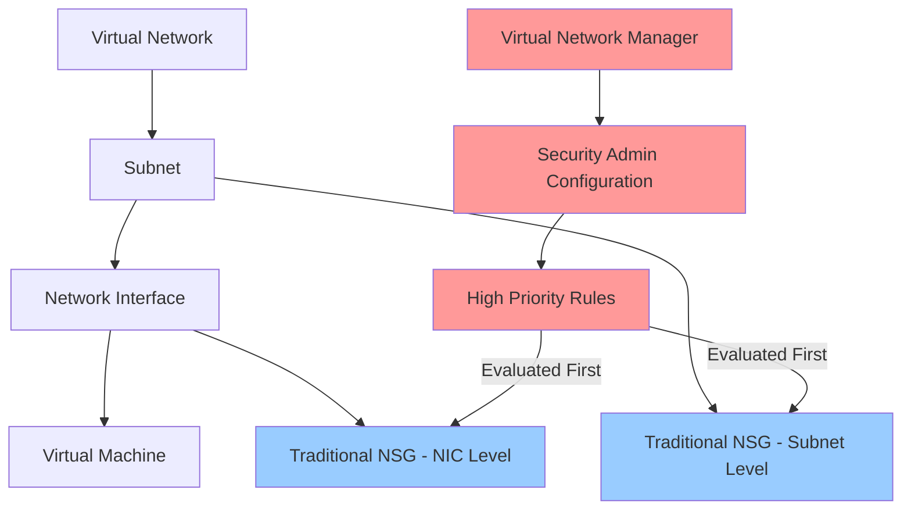

# Azure Virtual Network Manager - Child Resources Implementation Plan

## Overview

This document outlines all child resources that need to be implemented to provide full Azure Virtual Network Manager functionality. The current implementation only includes the base `VirtualNetworkManager` resource.

## Important Clarification: Resource Dependencies

**All resources listed in this document are EXCLUSIVELY child resources of Azure Virtual Network Manager.** They cannot be used independently or with other Azure resources.

### What This Means:

1. **Network Security Groups (NSGs)**: The "Security Admin Configurations" in Virtual Network Manager are NOT the same as traditional Azure Network Security Groups
   - Traditional NSGs: Independent resources that can be attached to subnets/NICs
   - Security Admin Configurations: Virtual Network Manager feature that creates HIGH-PRIORITY rules evaluated BEFORE NSGs
   - These are complementary, not replacements

2. **IPAM Pools**: Only work within Virtual Network Manager context
   - Cannot be used as standalone IP management
   - Require a Network Manager instance to exist

3. **Network Groups**: Virtual Network Manager-specific containers
   - Not the same as Azure Resource Groups or Management Groups
   - Only used to organize VNets for Network Manager configurations

4. **All Child Resources**: Require parent Network Manager ID
   - Resource Type Pattern: `Microsoft.Network/networkManagers/{childResource}`
   - Cannot exist without a parent Network Manager

### Relationship with Traditional NSGs



**Key Points:**
- Virtual Network Manager Security Admin Rules are evaluated FIRST
- Traditional NSGs are evaluated AFTER Security Admin Rules
- Security Admin Rules can OVERRIDE NSG rules (with "AlwaysAllow" or "Deny" actions)
- Both systems work together, not as replacements

### Existing vs. New Constructs

| Resource Type | Already Has Construct? | Location | Independence |
|---------------|----------------------|----------|--------------|
| Network Security Group | ✅ YES | `src/azure-networksecuritygroup/` | ✅ Independent |
| Virtual Network | ✅ YES | `src/azure-virtualnetwork/` | ✅ Independent |
| Subnet | ✅ YES | `src/azure-subnet/` | ⚠️ Requires VNet |
| Virtual Network Manager | ✅ YES | `src/azure-virtualnetworkmanager/` | ✅ Independent |
| IPAM Pools | ❌ NO | To be created | ❌ Requires Network Manager |
| Network Groups | ❌ NO | To be created | ❌ Requires Network Manager |
| Security Admin Configurations | ❌ NO | To be created | ❌ Requires Network Manager |
| Connectivity Configurations | ❌ NO | To be created | ❌ Requires Network Manager |
| Routing Configurations | ❌ NO | To be created | ❌ Requires Network Manager |


## Resource Hierarchy

```
Microsoft.Network/networkManagers (✅ Implemented)
├── ipamPools (❌ Not Implemented)
│   ├── staticCidrs (❌ Not Implemented)
│   └── basePools (❌ Not Implemented)
├── networkGroups (❌ Not Implemented)
│   └── staticMembers (❌ Not Implemented)
├── connectivityConfigurations (❌ Not Implemented)
├── securityAdminConfigurations (❌ Not Implemented)
│   └── ruleCollections (❌ Not Implemented)
│       └── rules (❌ Not Implemented)
├── routingConfigurations (❌ Not Implemented)
│   └── ruleCollections (❌ Not Implemented)
│       └── rules (❌ Not Implemented)
└── scopeConnections (❌ Not Implemented)
```

## Child Resource Types - Detailed Specifications

### 1. IPAM Pools (`Microsoft.Network/networkManagers/ipamPools`)

**Purpose**: IP Address Management - Centralized management of IP address spaces to prevent overlaps

**API Versions**: 
- 2025-01-01 (Latest)
- 2024-10-01
- 2024-07-01
- 2024-05-01
- 2024-01-01-preview

**Required Properties**:
- `name` (string): Pool name, pattern `^[0-9a-zA-Z]([0-9a-zA-Z_.-]{0,62}[0-9a-zA-Z_])?$`
- `location` (string): Azure region
- `addressPrefixes` (string[]): IP address prefixes (e.g., `["10.0.0.0/8"]`)

**Optional Properties**:
- `description` (string): Description of the IPAM pool
- `displayName` (string): Friendly display name
- `parentPoolName` (string): Parent pool name for hierarchical pools (empty for root pool)
- `tags` (object): Resource tags

**Regional Limitations**: NOT available in: Chile Central, Jio India West, Malaysia West, Qatar Central, South Africa West, West India, West US 3

**Child Resources**:
- `staticCidrs`: Static CIDR allocations within the pool
- `basePools`: Base pool configurations

**Use Cases**:
- Prevent IP address overlap across virtual networks
- Automatic subnet allocation
- Hierarchical IP address management
- Cross-tenant IP management

---

### 2. IPAM Pool Static CIDRs (`Microsoft.Network/networkManagers/ipamPools/staticCidrs`)

**Purpose**: Define static CIDR blocks within an IPAM pool

**API Versions**: Same as ipamPools (2024-05-01+)

**Required Properties**:
- `name` (string): Static CIDR name
- `addressPrefix` (string): CIDR block (e.g., `"10.1.0.0/16"`)

**Optional Properties**:
- `description` (string): Description
- `numberOfIPAddresses` (string): Number of IP addresses to allocate

---

### 3. Network Groups (`Microsoft.Network/networkManagers/networkGroups`)

**Purpose**: Logical containers for virtual networks or subnets to apply configurations at scale

**API Versions**: 
- 2025-01-01 (Latest)
- 2024-10-01
- 2024-05-01
- 2023-11-01

**Required Properties**:
- `name` (string): Network group name

**Optional Properties**:
- `description` (string): Description of the network group
- `memberType` (string): Type of members - `"VirtualNetwork"` or `"Subnet"`

**Membership Types**:
1. **Static Membership**: Manually add virtual networks using `staticMembers`
2. **Dynamic Membership**: Define via Azure Policy (not managed by static members)

**Child Resources**:
- `staticMembers`: Explicitly added virtual networks or subnets

**Use Cases**:
- Group VNets by environment (prod, test, dev)
- Group by region, business unit, or application
- Apply configurations to multiple VNets simultaneously

---

### 4. Network Group Static Members (`Microsoft.Network/networkManagers/networkGroups/staticMembers`)

**Purpose**: Explicitly add virtual networks or subnets to a network group

**API Versions**: Same as networkGroups (2024-05-01+)

**Required Properties**:
- `name` (string): Member name
- `resourceId` (string): Full resource ID of the VNet or Subnet

**Use Cases**:
- Manually curated network group membership
- Precise control over which resources receive configurations

---

### 5. Connectivity Configurations (`Microsoft.Network/networkManagers/connectivityConfigurations`)

**Purpose**: Define network topology (mesh or hub-and-spoke) for virtual networks

**API Versions**: 
- 2025-01-01
- 2024-10-01
- 2024-05-01
- 2023-11-01

**Required Properties**:
- `name` (string): Configuration name
- `connectivityTopology` (string): `"HubAndSpoke"` or `"Mesh"`
- `appliesToGroups` (array): Network groups to apply configuration to

**Optional Properties**:
- `description` (string): Description
- `isGlobal` (boolean): Enable global mesh connectivity
- `deleteExistingPeering` (boolean): Delete existing peerings when applying
- `hubs` (array): Hub VNets (required for hub-and-spoke)

**Topology Types**:

1. **Mesh**: All VNets in the group can communicate directly
   - Use case: VNets that need direct communication without hub
   
2. **Hub-and-Spoke**: Central hub with spoke VNets
   - Use case: Shared services in hub (firewalls, VPN gateways)
   - Can enable direct spoke-to-spoke connectivity

**Use Cases**:
- Create hub-and-spoke topologies at scale
- Mesh specific spoke networks for better latency
- Maintain topology automatically when adding/removing VNets

---

### 6. Security Admin Configurations (`Microsoft.Network/networkManagers/securityAdminConfigurations`)

**Purpose**: High-priority security rules that override NSG rules

**API Versions**: 
- 2025-01-01
- 2024-10-01
- 2024-05-01
- 2023-11-01

**Required Properties**:
- `name` (string): Configuration name

**Optional Properties**:
- `description` (string): Description
- `applyOnNetworkIntentPolicyBasedServices` (array): Services to apply on

**Features**:
- **Evaluated BEFORE NSGs**: Higher priority than network security groups
- **Three action types**:
  - `Allow`: Evaluated first, NSG can still deny
  - `Deny`: Stop traffic, no NSG evaluation
  - `Always Allow`: Force allow, overrides NSG denies

**Child Resources**:
- `ruleCollections`: Collections of security rules
  - `rules`: Individual security admin rules

**Use Cases**:
- Block high-risk ports (SSH, RDP, etc.) organization-wide
- Force-allow monitoring/security scanner traffic
- Enforce security policies that can't be overridden by teams
- Default security rules when NSGs are misconfigured

---

### 7. Security Admin Rule Collections (`Microsoft.Network/networkManagers/securityAdminConfigurations/ruleCollections`)

**Purpose**: Group related security admin rules together

**API Versions**: Same as securityAdminConfigurations

**Required Properties**:
- `name` (string): Rule collection name
- `appliesToGroups` (array): Target network groups

**Optional Properties**:
- `description` (string): Description

---

### 8. Security Admin Rules (`Microsoft.Network/networkManagers/securityAdminConfigurations/ruleCollections/rules`)

**Purpose**: Individual security rules with high priority

**API Versions**: Same as securityAdminConfigurations

**Required Properties**:
- `name` (string): Rule name
- `priority` (number): Priority (1-4096, lower = higher priority)
- `action` (string): `"Allow"`, `"Deny"`, or `"AlwaysAllow"`
- `direction` (string): `"Inbound"` or `"Outbound"`
- `protocol` (string): `"Tcp"`, `"Udp"`, `"Icmp"`, `"Esp"`, `"Ah"`, or `"Any"`

**Optional Properties**:
- `description` (string): Rule description
- `sourcePortRanges` (array): Source ports (e.g., `["*"]`, `["80", "443"]`)
- `destinationPortRanges` (array): Destination ports
- `sources` (array): Source addresses/network groups
- `destinations` (array): Destination addresses/network groups

**Network Group as Source/Destination** (Preview):
- Can use network groups instead of CIDR ranges
- Automatically aggregates IP ranges from network group members
- Simplifies rule management across environments

**High-Risk Ports to Block**:
- 20, 21 (FTP)
- 22 (SSH)
- 23 (Telnet)
- 69 (TFTP)
- 111 (RPC)
- 135 (RPC EPMAP)
- 445 (SMB)
- 3389 (RDP)
- 5900 (VNC)

---

### 9. Routing Configurations (`Microsoft.Network/networkManagers/routingConfigurations`)

**Purpose**: Manage user-defined routes (UDRs) at scale

**API Versions**: 
- 2025-01-01
- 2024-10-01
- 2024-05-01 (Feature introduced)

**Required Properties**:
- `name` (string): Configuration name

**Optional Properties**:
- `description` (string): Description

**Features**:
- Orchestrate UDRs across multiple virtual networks
- Centralized route management
- Override default Azure routing behavior

**Requirements**:
- Network Manager must have `"Routing"` in `networkManagerScopeAccesses`
- Available in API version 2024-05-01 or later

**Child Resources**:
- `ruleCollections`: Collections of routing rules
  - `rules`: Individual routing rules

**Use Cases**:
- Force traffic through network virtual appliances (NVAs)
- Custom routing for hybrid connectivity
- Traffic engineering at scale

---

### 10. Routing Rule Collections (`Microsoft.Network/networkManagers/routingConfigurations/ruleCollections`)

**Purpose**: Group related routing rules together

**API Versions**: Same as routingConfigurations (2024-05-01+)

**Required Properties**:
- `name` (string): Rule collection name
- `appliesToGroups` (array): Target network groups

**Optional Properties**:
- `description` (string): Description

---

### 11. Routing Rules (`Microsoft.Network/networkManagers/routingConfigurations/ruleCollections/rules`)

**Purpose**: Define individual routing rules

**API Versions**: Same as routingConfigurations (2024-05-01+)

**Required Properties**:
- `name` (string): Rule name
- `destination` (object): Destination configuration
- `nextHop` (object): Next hop configuration

**Use Cases**:
- Route traffic to firewalls/NVAs
- Custom routing for ExpressRoute/VPN
- Force tunneling scenarios

---

### 12. Scope Connections (`Microsoft.Network/networkManagers/scopeConnections`)

**Purpose**: Enable cross-tenant management - allow Network Manager to manage resources in another tenant

**API Versions**: 
- 2025-01-01
- 2024-10-01
- 2024-05-01
- 2023-11-01

**Required Properties**:
- `name` (string): Connection name
- `resourceId` (string): Target Network Manager resource ID in other tenant
- `tenantId` (string): Target tenant ID

**Optional Properties**:
- `description` (string): Description

**Use Cases**:
- Multi-tenant organizations
- Managed service providers managing customer networks
- Enterprise with multiple Azure AD tenants

**Requirements**:
- Authentication to both tenants
- Network Contributor role in target tenant

---

## Implementation Priority & Phases

### Phase 1: Core Networking (High Priority)
**Required for basic network management**

1. **Network Groups** ⭐⭐⭐
   - Foundation for all configurations
   - Required by connectivity, security, and routing configs
   
2. **Network Group Static Members** ⭐⭐⭐
   - Enables static membership management
   - Works with Network Groups

3. **Connectivity Configurations** ⭐⭐⭐
   - Core feature for topology management
   - Hub-and-spoke and mesh topologies

### Phase 2: Security (High Priority)
**Requested feature - NSG management**

4. **Security Admin Configurations** ⭐⭐⭐
   - Addresses the user's NSG requirement
   - High-priority security rules
   
5. **Security Admin Rule Collections** ⭐⭐⭐
   - Required for Security Admin Configurations
   
6. **Security Admin Rules** ⭐⭐⭐
   - Individual security rules
   - Block high-risk ports

### Phase 3: IP Management (High Priority)
**Requested feature - IPAM pools**

7. **IPAM Pools** ⭐⭐⭐
   - Addresses the user's IP address pool requirement
   - Prevents IP overlap
   
8. **IPAM Pool Static CIDRs** ⭐⭐
   - Static allocations within pools
   - Works with IPAM Pools

### Phase 4: Advanced Features (Medium Priority)

9. **Routing Configurations** ⭐⭐
   - Advanced UDR management
   - Requires API version 2024-05-01+
   
10. **Routing Rule Collections** ⭐⭐
    - Required for Routing Configurations
    
11. **Routing Rules** ⭐⭐
    - Individual routing rules

### Phase 5: Enterprise Features (Lower Priority)

12. **Scope Connections** ⭐
    - Cross-tenant scenarios
    - Less common use case

---

## Recommended Implementation Approach

### Analysis: Since All Resources Are Children of Network Manager

Given that **ALL these resources are strictly child resources** that cannot exist independently, let's re-evaluate the options:

### Option A: Separate Construct Classes
**Still Recommended** ✅

**Why Option A is STILL better despite being child resources:**

1. **Scale and Complexity**
   - 12 different resource types with unique schemas
   - Each has 100-300+ lines of implementation
   - VirtualNetworkManager would become 3000+ lines (unmaintainable)

2. **Multi-Level Hierarchies**
   ```
   NetworkManager
   ├── SecurityAdminConfiguration (child level 1)
   │   └── RuleCollection (child level 2)
   │       └── Rule (child level 3)
   └── RoutingConfiguration (child level 1)
       └── RuleCollection (child level 2)
           └── Rule (child level 3)
   ```
   - Option B doesn't handle nested children well
   - Would need methods like `config.addRuleCollection().addRule()` - awkward

3. **Testing and Maintenance**
   - Each resource has its own test file (50-100 lines each)
   - Easier to add features to one resource without touching others
   - Multiple developers can work on different resources simultaneously

4. **JSII Compatibility**
   - Large classes with many methods are harder to generate bindings for
   - Python, Java, C# users get better IDE support with separate classes

5. **Project Consistency**
   - Every other Azure resource in this project is a separate construct
   - Subnet is a child of VNet, but it's still a separate construct
   - Diagnostic Settings is a child resource, but it's separate

6. **Import Granularity**
   ```typescript
   // Option A: Import only what you need
   import { NetworkGroup, IpamPool } from "@microsoft/terraform-cdk-constructs/azure-virtualnetworkmanager";
   
   // Option B: Must import entire VirtualNetworkManager even if just using one feature
   import { VirtualNetworkManager } from "@microsoft/terraform-cdk-constructs/azure-virtualnetworkmanager";
   ```

### Option B: Methods on VirtualNetworkManager
**Not Recommended** ❌

**Why Option B becomes impractical:**

1. **File Size**
   - VirtualNetworkManager.ts would be 3000+ lines
   - Includes 12 child resources + their methods
   - Hard to navigate and maintain

2. **Circular Dependencies**
   - NetworkGroup has StaticMembers
   - SecurityAdminConfiguration has RuleCollections has Rules
   - All in one file = complex internal references

3. **Limited Flexibility**
   ```typescript
   // What if user wants to create a rule collection separately?
   // With Option B, they're forced to go through the parent
   const config = vnm.addSecurityConfig(...);
   const collection = config.addRuleCollection(...); // Forced pattern
   
   // With Option A, more flexibility
   const collection = new RuleCollection(this, "rules", {
     securityConfigId: existingConfigId, // Can reference existing resources
   });
   ```

### Option C: Hybrid Approach (Recommended Alternative)
**Best Compromise** ⭐

Separate construct classes + **optional** convenience methods on VirtualNetworkManager:

```typescript
// Separate classes exist (primary way)
class NetworkGroup extends AzapiResource { ... }
class IpamPool extends AzapiResource { ... }

// VirtualNetworkManager has OPTIONAL convenience methods
class VirtualNetworkManager extends AzapiResource {
  /**
   * Convenience method to create a NetworkGroup
   * Alternatively, use: new NetworkGroup(this, id, { networkManagerId: vnm.id, ...props })
   */
  public addNetworkGroup(id: string, props: Omit<NetworkGroupProps, 'networkManagerId'>): NetworkGroup {
    return new NetworkGroup(this, id, {
      ...props,
      networkManagerId: this.id,
    });
  }
  
  // Similar convenience methods for other TOP-LEVEL children only
  // (Don't add methods for nested children like Rules)
}
```

**Why Option C is the Best Compromise:**

1. ✅ Keeps classes separate (maintainable)
2. ✅ Provides convenience for common cases
3. ✅ Users can choose their preferred style
4. ✅ Doesn't force a single pattern
5. ✅ Only adds convenience methods for TOP-LEVEL children (not nested ones)

**Example Usage with Option C:**

```typescript
const vnm = new VirtualNetworkManager(this, "vnm", { ... });

// Style 1: Using convenience methods (more fluent)
const ng1 = vnm.addNetworkGroup("ng1", {
  name: "production-vnets",
});

// Style 2: Using separate classes (more explicit)
const ng2 = new NetworkGroup(this, "ng2", {
  networkManagerId: vnm.id,
  name: "test-vnets",
});

// For nested children, MUST use separate classes
// (No convenience methods for these)
const staticMember = new StaticMember(this, "member", {
  networkGroupId: ng1.id,
  resourceId: vnetId,
});
```

### Final Recommendation

**Use Option C (Hybrid)**:
- Create separate construct classes for ALL child resources
- Add convenience methods to VirtualNetworkManager for TOP-LEVEL children only:
  - `addNetworkGroup()`
  - `addIpamPool()`
  - `addConnectivityConfiguration()`
  - `addSecurityAdminConfiguration()`
  - `addRoutingConfiguration()`
  - `addScopeConnection()`
- Do NOT add convenience methods for nested children (RuleCollections, Rules, StaticMembers, etc.)

**Advantages of This Approach:**
- ✅ Maintainable (separate files)
- ✅ Flexible (use either pattern)
- ✅ Consistent (follows project patterns)
- ✅ Developer-friendly (fluent API available)
- ✅ Testable (each resource independently)
- ✅ JSII-compatible (not too large)
- ✅ Scalable (easy to add new resources)

**Implementation Effort:**
- Same as Option A (separate classes must be created regardless)
- Plus ~6 simple convenience methods (10-15 lines each)
- Total additional code: ~100 lines

---

## API Version Strategy

### Recommended Versions

| Resource Type | Recommended API Version | Minimum Supported |
|---------------|------------------------|-------------------|
| Network Manager | 2024-05-01 | 2023-11-01 |
| Network Groups | 2024-05-01 | 2023-11-01 |
| Connectivity Configurations | 2024-05-01 | 2023-11-01 |
| Security Admin Configurations | 2024-05-01 | 2023-11-01 |
| Routing Configurations | 2024-05-01 | 2024-05-01 (new feature) |
| IPAM Pools | 2024-05-01 | 2024-01-01-preview |
| Scope Connections | 2024-05-01 | 2023-11-01 |

### Version Support Strategy

1. **Default to Latest Stable**: Use 2024-05-01 or 2025-01-01 as default
2. **Allow Version Pinning**: Users can specify `apiVersion` for stability
3. **Maintain 2 Versions**: Support current + previous stable version
4. **Clear Deprecation Path**: Document when versions are deprecated

---

## Testing Strategy

### Unit Tests (Required)
- Schema validation
- Property transformation
- Parent ID resolution
- Error handling

### Integration Tests (Required)
- Create resources in Azure
- Verify resource properties
- Test parent-child relationships
- Clean up resources

### Example Integration Test Structure

```typescript
describe('VirtualNetworkManager Child Resources', () => {
  let resourceGroup: ResourceGroup;
  let networkManager: VirtualNetworkManager;
  
  beforeAll(async () => {
    // Create test resource group and network manager
  });
  
  afterAll(async () => {
    // Clean up all resources
  });
  
  describe('NetworkGroup', () => {
    it('should create a network group', async () => {
      // Test
    });
    
    it('should add static members', async () => {
      // Test
    });
  });
  
  describe('IpamPool', () => {
    it('should create an IPAM pool', async () => {
      // Test
    });
    
    it('should allocate static CIDR', async () => {
      // Test
    });
  });
  
  // etc.
});
```

---

## Documentation Requirements

### For Each Resource Type

1. **README.md** with:
   - Overview and purpose
   - Use cases
   - API reference
   - Usage examples (basic and advanced)
   - Best practices
   - Regional availability (for IPAM)
   - Troubleshooting

2. **API_RESEARCH.md** with:
   - Full API specifications
   - Property definitions
   - Validation rules
   - Parent-child relationships
   - Cross-references to Microsoft Learn docs

3. **Examples** in README:
   - Basic usage
   - Advanced scenarios
   - Integration with other resources
   - Common patterns

---

## File Structure

### Proposed Directory Structure

```
src/azure-virtualnetworkmanager/
├── index.ts (exports)
├── README.md (updated with child resources)
├── API_RESEARCH.md (existing)
├── CHILD_RESOURCES_PLAN.md (this file)
├── lib/
│   ├── index.ts
│   ├── virtual-network-manager.ts (existing)
│   ├── virtual-network-manager-schemas.ts (existing)
│   ├── network-group.ts (new)
│   ├── network-group-schemas.ts (new)
│   ├── network-group-static-member.ts (new)
│   ├── network-group-static-member-schemas.ts (new)
│   ├── ipam-pool.ts (new)
│   ├── ipam-pool-schemas.ts (new)
│   ├── ipam-pool-static-cidr.ts (new)
│   ├── ipam-pool-static-cidr-schemas.ts (new)
│   ├── connectivity-configuration.ts (new)
│   ├── connectivity-configuration-schemas.ts (new)
│   ├── security-admin-configuration.ts (new)
│   ├── security-admin-configuration-schemas.ts (new)
│   ├── security-admin-rule-collection.ts (new)
│   ├── security-admin-rule-collection-schemas.ts (new)
│   ├── security-admin-rule.ts (new)
│   ├── security-admin-rule-schemas.ts (new)
│   ├── routing-configuration.ts (new)
│   ├── routing-configuration-schemas.ts (new)
│   ├── routing-rule-collection.ts (new)
│   ├── routing-rule-collection-schemas.ts (new)
│   ├── routing-rule.ts (new)
│   ├── routing-rule-schemas.ts (new)
│   ├── scope-connection.ts (new)
│   └── scope-connection-schemas.ts (new)
├── test/
│   ├── virtual-network-manager.spec.ts (existing)
│   ├── virtual-network-manager.integ.ts (existing)
│   ├── network-group.spec.ts (new)
│   ├── network-group.integ.ts (new)
│   ├── ipam-pool.spec.ts (new)
│   ├── ipam-pool.integ.ts (new)
│   ├── security-admin-configuration.spec.ts (new)
│   ├── security-admin-configuration.integ.ts (new)
│   └── ... (tests for each resource)
└── examples/ (optional)
    ├── basic-network-group.ts
    ├── ipam-with-static-cidrs.ts
    ├── security-admin-rules.ts
    └── full-vnm-setup.ts
```

---

## Dependencies and Prerequisites

### Required Package Versions
- `cdktf`: ^0.20.0 (already met)
- `constructs`: ^10.0.0 (already met)
- `@cdktf/provider-azapi`: Latest (already met)

### Required Azure Resources
Some child resources require other resources to exist first:

1. **Network Groups**:
   - Requires: Network Manager with appropriate scope

2. **Connectivity Configurations**:
   - Requires: Network Manager with `"Connectivity"` in `networkManagerScopeAccesses`
   - Requires: At least one Network Group

3. **Security Admin Configurations**:
   - Requires: Network Manager with `"SecurityAdmin"` in `networkManagerScopeAccesses`
   - Requires: At least one Network Group

4. **Routing Configurations**:
   - Requires: Network Manager with `"Routing"` in `networkManagerScopeAccesses`
   - Requires: API version 2024-05-01 or later
   - Requires: At least one Network Group

5. **IPAM Pools**:
   - Requires: Network Manager (no special scope access needed)
   - Regional limitations apply

---

## Breaking Changes and Migration

### Current State
- Only base `VirtualNetworkManager` implemented
- No child resource support

### Migration Path
When adding child resources:

1. **No Breaking Changes**: Adding new constructs doesn't break existing code
2. **Backward Compatible**: Current `VirtualNetworkManager` usage remains unchanged
3. **Opt-In**: Users choose when to adopt child resources
4. **Documentation**: Provide migration guide for common patterns

---

## Success Criteria

### Minimum Viable Product (MVP)
Phase 1-3 complete:
- ✅ Network Groups + Static Members
- ✅ Connectivity Configurations
- ✅ Security Admin Configurations (full hierarchy)
- ✅ IPAM Pools + Static CIDRs

### Full Feature Set
All phases complete:
- ✅ All 12 resource types implemented
- ✅ Comprehensive tests (unit + integration)
- ✅ Full documentation
- ✅ Examples for common scenarios
- ✅ API version support strategy documented

---

## Next Steps

1. **Gather Requirements**: Confirm with user which resources are highest priority
2. **Create Detailed Design**: For Phase 1 resources (Network Groups, Connectivity)
3. **Implementation**: Start with Network Groups (foundation for other features)
4. **Testing**: Unit and integration tests
5. **Documentation**: Update READMEs with new features
6. **Iterate**: Move through phases based on user feedback

---

## References

- [Azure Virtual Network Manager Documentation](https://learn.microsoft.com/en-us/azure/virtual-network-manager/)
- [Network Manager ARM Templates](https://learn.microsoft.com/en-us/azure/templates/microsoft.network/networkmanagers)
- [IPAM Documentation](https://learn.microsoft.com/en-us/azure/virtual-network-manager/how-to-manage-ip-addresses-network-manager)
- [Security Admin Rules](https://learn.microsoft.com/en-us/azure/virtual-network-manager/concept-security-admins)
- [Azure Bicep Registry - Network Manager Module](https://github.com/Azure/bicep-registry-modules/tree/main/avm/res/network/network-manager)